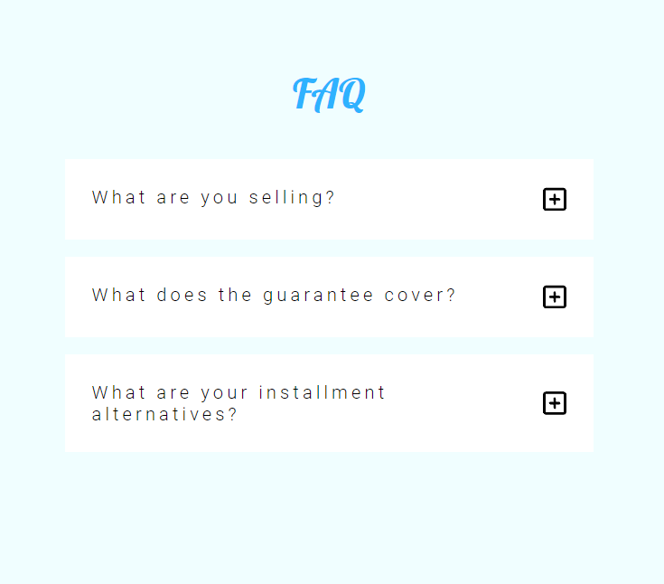
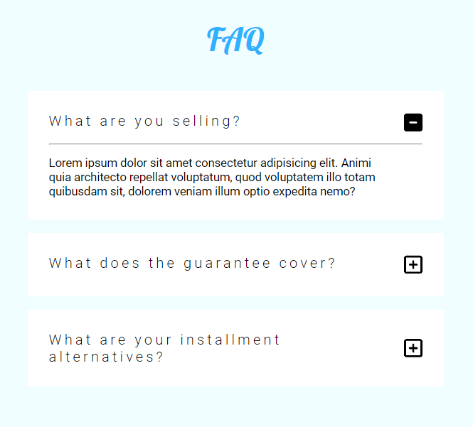

## FAQ project

### Idea

We will have some questions, each containing a button that toggles the response.

### Actions

1. Clicking the button attached to the question toggles the response to that question.
2. Clicking another button when a response is already being shown, will close the last response and open the current one.

### Project Capture

###### \#1

###### \#2

### Notes

Project done 100% by me.
