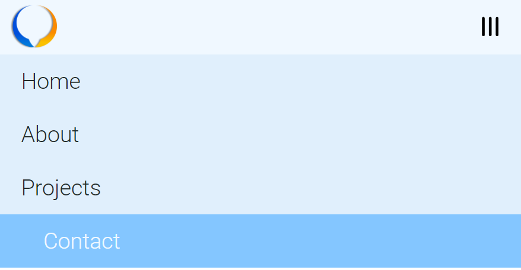

## Navbar project

### Idea

We will have a navigation bar that contains a logo, link buttons including social media and a menu button.

### Actions

Navbar will have two sizes:

1. Small - Contains menu button that toggles link buttons.
2. Wide - Contains no menu button, instead link buttons and social media are included in the navbar.

### Project Captures

#####\#1

#####\#2

#####\#3

### Notes

Project done 100% by me.
